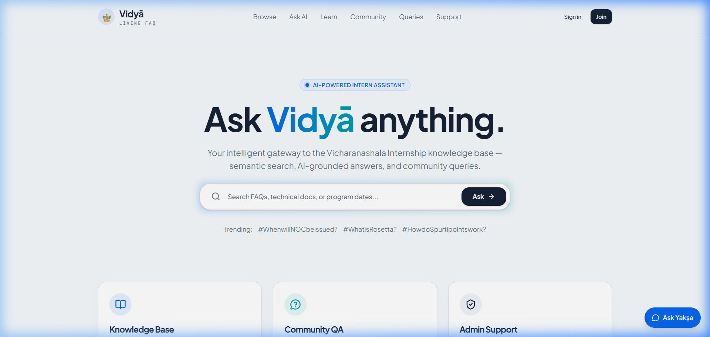
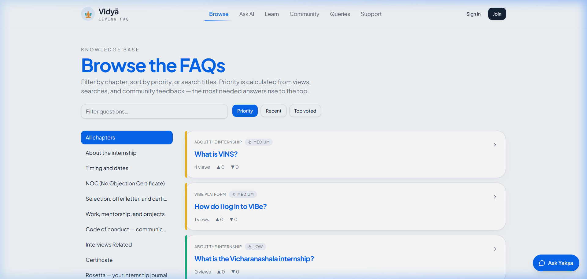
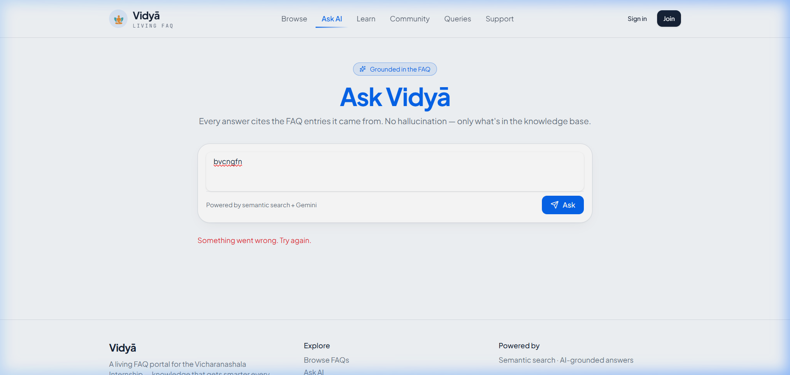
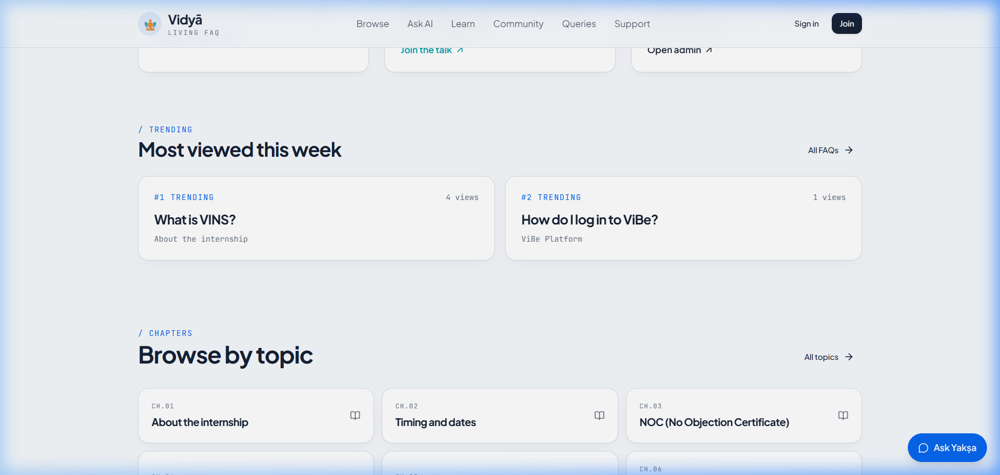

<h1 align="center">Vidyā — Living FAQ Portal</h1>

<p align="center">
  <strong>An AI-powered, crowd-sourced knowledge base for the Vicharanashala Internship (VINS) at IIT Ropar</strong>
</p>

<p align="center">
  <a href="https://crowd-source-faq-seven.vercel.app">🌐 Live Demo</a> •
  <a href="#-features">✨ Features</a> •
  <a href="#-tech-stack">🛠 Tech Stack</a> •
  <a href="#-getting-started">🚀 Getting Started</a> •
  <a href="#-architecture">🏗 Architecture</a>
</p>

<p align="center">
  <a href="https://crowd-source-faq-seven.vercel.app">
    
  </a>
</p>


<p align="center">
  
  
  
  
  
  
  
</p>

---

## 📸 Preview

<p align="center">
  
</p>

<details>
<summary><strong>📷 More Screenshots</strong></summary>

| Browse FAQs | Ask AI |
|:-----------:|:------:|
|  |  |

| Home — Features Section |
|:-----------------------:|
|  |

</details>

---

## ✨ Features

### 🔍 Semantic Search
Vector-powered FAQ search using **pgvector** and Gemini Embeddings. Every query finds the most semantically relevant answers — not just keyword matches.

### 🤖 Ask AI (Yakṣa)
A grounded AI assistant that answers questions **only** from your FAQ knowledge base. Cites sources with bracket references like `[1]`, `[2]`. Zero hallucination by design.

### 📚 Browse & Discover
Organized FAQ categories with priority-sorted entries, view counts, upvotes/downvotes, and tag-based filtering. Beautiful card-based UI with smooth animations.

### ❓ Raise a Query
Students can submit questions that aren't yet answered in the FAQ. Admins review, answer, and optionally promote queries to full FAQ entries.

### 👥 Community
Public community hub where users can see submitted queries, upvote important ones, and track admin responses.

### 🛡️ Admin Dashboard
Full-featured admin panel with:
- **FAQ CRUD** — Create, edit, delete, and toggle publish state
- **Category Management** — Add/edit/reorder categories
- **Query Triage** — Review, answer, and close student queries
- **Analytics** — View counts, search logs, and trending topics
- **User & Role Management** — Promote users to admin/moderator

### 🔐 Authentication
- **Google OAuth** sign-in via Supabase Auth
- **Custom email/password** admin accounts
- Role-based access control (`admin`, `moderator`, `user`)
- Row-Level Security (RLS) on every table

### 🎓 Learning Modules
Curated learning content with chapter-based navigation, progress tracking, and enrollment management.

### 📊 User Dashboard
Personalized dashboard with activity stats, recent queries, bookmarked FAQs, and learning progress.

---

## 🛠 Tech Stack

| Layer | Technology |
|-------|-----------|
| **Framework** | [TanStack Start](https://tanstack.com/start) (Vite + React 19 + TypeScript + Vinxi + Nitro) |
| **Styling** | [Tailwind CSS v4](https://tailwindcss.com/) + [Radix UI](https://radix-ui.com/) primitives |
| **Database** | [Supabase](https://supabase.com/) (PostgreSQL + pgvector + Row-Level Security) |
| **Auth** | Supabase Auth (Google OAuth + Email/Password) |
| **AI** | [Google Gemini API](https://ai.google.dev/) — `gemini-embedding-001` + `gemini-3.1-flash-lite` |
| **Animations** | [Motion](https://motion.dev/) (Framer Motion v12) |
| **Charts** | [Recharts](https://recharts.org/) |
| **Icons** | [Lucide React](https://lucide.dev/) |
| **Deployment** | [Vercel](https://vercel.com/) (Nitro auto-preset) |

---

## 🏗 Architecture

```
┌─────────────────────────────────────────────────────┐
│                    Client (React 19)                │
│  ┌─────────┐ ┌──────────┐ ┌────────┐ ┌───────────┐ │
│  │ Browse  │ │  Ask AI  │ │Queries │ │  Admin    │ │
│  │  FAQs   │ │ (Yakṣa)  │ │  Page  │ │ Dashboard │ │
│  └────┬────┘ └────┬─────┘ └───┬────┘ └─────┬─────┘ │
│       │           │           │             │       │
│  ┌────▼───────────▼───────────▼─────────────▼─────┐ │
│  │         TanStack Server Functions              │ │
│  │        (createServerFn — Nitro/Vinxi)          │ │
│  └────┬───────────┬───────────────────────────────┘ │
└───────┼───────────┼─────────────────────────────────┘
        │           │
   ┌────▼────┐ ┌────▼──────────────┐
   │Supabase │ │   Gemini API      │
   │  (DB)   │ │  ┌──────────────┐ │
   │ ┌─────┐ │ │  │ Embeddings   │ │
   │ │pgvec│ │ │  │ (1536-dim)   │ │
   │ │ tor │ │ │  ├──────────────┤ │
   │ └─────┘ │ │  │ Chat (LLM)   │ │
   │  + RLS  │ │  │ Grounded Q&A │ │
   └─────────┘ │  └──────────────┘ │
               └───────────────────┘
```

### Key Design Decisions

- **Server Functions**: All database and AI calls run server-side via TanStack's `createServerFn`. API keys never reach the client.
- **pgvector**: FAQ embeddings stored directly in PostgreSQL for fast cosine-similarity search via `match_faqs` RPC.
- **Grounded AI**: The Ask AI feature retrieves relevant FAQ context first, then sends it to the LLM with strict grounding instructions — preventing hallucination.
- **Row-Level Security**: Every Supabase table enforces RLS policies. Admins see everything; students see only published content and their own data.

---

## 🚀 Getting Started

### Prerequisites

- **Node.js** ≥ 18
- **npm** ≥ 9
- A [Supabase](https://supabase.com/) project (free tier works)
- A [Google Gemini API key](https://aistudio.google.com/apikey) (free tier works)

### 1. Clone & Install

```bash
git clone https://github.com/Pradeep-Gupta7/crowd-source-faq.git
cd crowd-source-faq
npm install
```

### 2. Database Setup

Run the schema migration in your Supabase SQL Editor:

```bash
# Copy and paste the contents of schema.sql into the Supabase SQL Editor and execute it.
# Then seed the FAQ data:
# Copy and paste the contents of seed_data.sql into the Supabase SQL Editor and execute it.
```

### 3. Environment Variables

Create a `.env` file in the project root:

```env
# Supabase
SUPABASE_URL="https://YOUR_PROJECT_ID.supabase.co"
SUPABASE_PUBLISHABLE_KEY="sb_publishable_..."
SUPABASE_SERVICE_ROLE_KEY="sb_secret_..."

# Client-side (Vite requires VITE_ prefix)
VITE_SUPABASE_URL="https://YOUR_PROJECT_ID.supabase.co"
VITE_SUPABASE_PUBLISHABLE_KEY="sb_publishable_..."

# AI (Google Gemini)
GEMINI_API_KEY="your-gemini-api-key"
```

### 4. Run Locally

```bash
npm run dev
```

Open [http://localhost:3000](http://localhost:3000) in your browser.

### 5. Create an Admin User

1. Sign up via the app (Google OAuth or email/password)
2. In Supabase SQL Editor, promote your user to admin:

```sql
INSERT INTO public.user_roles (user_id, role)
VALUES (
  (SELECT id FROM auth.users WHERE email = 'your-email@example.com'),
  'admin'
)
ON CONFLICT DO NOTHING;
```

---

## 🌐 Deployment (Vercel)

Vidyā is fully optimized for **Vercel** via Nitro's auto-preset detection.

1. **Link** your GitHub repo on [vercel.com](https://vercel.com)
2. **Set Environment Variables** in the Vercel project settings:
   - `SUPABASE_URL`
   - `SUPABASE_PUBLISHABLE_KEY`
   - `SUPABASE_SERVICE_ROLE_KEY`
   - `VITE_SUPABASE_URL`
   - `VITE_SUPABASE_PUBLISHABLE_KEY`
   - `GEMINI_API_KEY`
3. **Deploy** — framework auto-detected as TanStack Start

> **Build Command**: `npm run build`  
> **Output Directory**: `.output`

---

## 📁 Project Structure

```
vidya/
├── public/                  # Static assets (logo, screenshots)
├── src/
│   ├── components/          # Reusable UI components (shadcn/ui based)
│   ├── hooks/               # Custom React hooks
│   ├── integrations/        # Supabase client, types, auth middleware
│   ├── lib/                 # Server-side AI helpers, utilities
│   │   ├── ai.server.ts     # Gemini embed() and chat() functions
│   │   └── faq.functions.ts # All TanStack Server Functions
│   └── routes/
│       ├── index.tsx         # Landing page
│       ├── browse.tsx        # FAQ browser with category filters
│       ├── ask.tsx           # AI-grounded Q&A page
│       ├── queries.tsx       # Community queries
│       ├── auth.tsx          # Login / Sign-up
│       └── _authenticated/   # Protected routes
│           ├── admin.tsx     # Admin dashboard
│           ├── dashboard.tsx # User dashboard
│           ├── community.tsx # Community hub
│           └── courses.tsx   # Learning modules
├── schema.sql               # Complete database schema (pgvector + RLS)
├── seed_data.sql             # FAQ seed data (150+ entries)
└── vercel.json               # Vercel configuration
```

---

## 🧪 Key Server Functions

| Function | Description |
|----------|-------------|
| `listCategories` | Fetch all FAQ categories |
| `listFaqs` | List FAQs with sorting & filtering |
| `semanticSearch` | Vector similarity search via pgvector |
| `askAi` | Grounded AI answer using Gemini LLM |
| `voteFaq` | Upvote/downvote a FAQ entry |
| `submitQuery` | Submit a student query |
| `adminCreateFaq` | Admin: create a new FAQ |
| `adminUpdateFaq` | Admin: edit an existing FAQ |
| `adminDeleteFaq` | Admin: delete a FAQ |
| `adminAnswerQuery` | Admin: answer a student query |

---

## 🤝 Contributing

1. Fork the repository
2. Create a feature branch: `git checkout -b feature/amazing-feature`
3. Commit your changes: `git commit -m 'Add amazing feature'`
4. Push to the branch: `git push origin feature/amazing-feature`
5. Open a Pull Request

---

## 📄 License

This project is part of the **Vicharanashala Internship (VINS)** at IIT Ropar.

---

<p align="center">
  Built with ❤️ using React, TanStack, Supabase & Gemini AI
</p>
